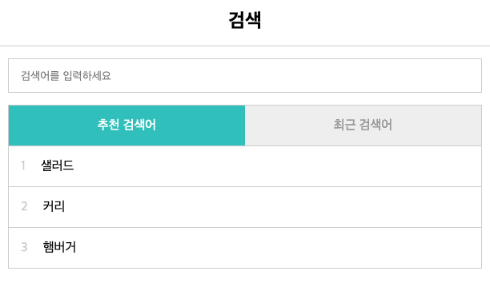
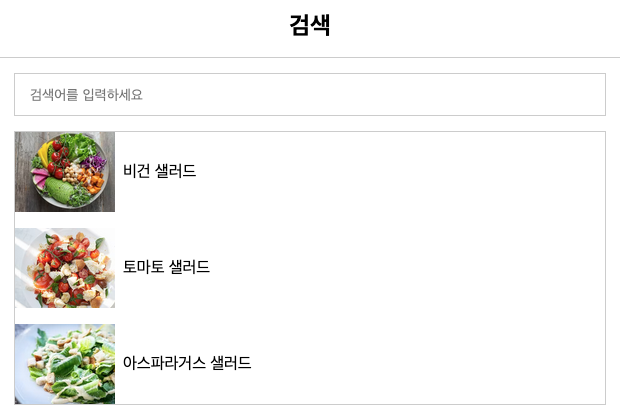

### Repository 소개

이 레포는 Vanilla JS MVC 패턴을 구현을 공부한 것을 정리하는 레포입니다. 

라이브러리/프레임 워크 없이 Vanilla JS 로 애플리케이션 기능을 구현하는 과정과 과정에서 공부한 내용들을 정리합니다.

### Section01 : 추천 검색, 최근 검색이 있는 검색폼

### 📚 [정리 노트](https://github.com/penguin311/Vanilla-JS-Study/blob/master/Section01_Search_Form/Section01_studyLog.md)
 

---
 

### -Section02 : 프로그래머스 데브매칭 고양이 사진검색 사이트