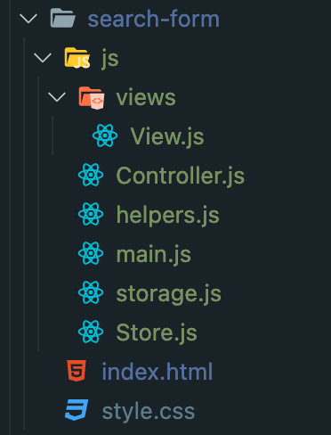

# 만들고 비교하며 학습하는 리액트

## 📍 Why

간단한 JS 공부를 마친 후 React 프레임워크로 프론트엔드 공부를 시작하게 되었다.
한참을 React 공부를 하던 중, 프로그래머스 데브 매칭을 알게되었고 Vanilla JS 로만 구현하는 과제를 보고
Vanilla JS 가 React 보다 쉬울것이라 단단히 오해를 한 채 과제를 열었지만 왠걸.. MVC 패턴을 JS 로 구현하는 것에 대해 하나도 모르고 있었다는 것을 깨달았다.

예전에 강의를 듣긴했지만 코드를 클론해서 진행했던 (거의 못알아들었던..) 강의가 생각이 났고 이 강의를 다시한번 복습하면서 JS 로 MVC 패턴 구현을 다시한번 공부해야겠다는 다짐을 하게되었다.
이번에는 클론 후 진행하는 것이 아니라 초기셋팅부터 차근차근 공부해 나갈 예정이다.

---

### 실습 환경 구성하기

`npx lite-server --baseDir 폴더명`
Webpack, Babel 없이 구현하여 type=module 을 사용한다.
type=module 만 사용하면 CORS 에러가 나는데, lite-server를 사용하면 CORS 없이 개발서버를 띄워준다. (--baseDir 폴더명 을 설정해주면 폴더명을 기준으로 lite-server를 띄워준다.)


### MVC 패턴에 대한 이해 
화면 개발에서 자주 쓰이는 디자인 패턴으로 
Model , View , Controller 세 계층으로 나눠 프로그래밍 문제를 해결하는 접근법.
- Model : 데이터를 관리하는 역할을 하며 데이터를 수정,삭제할 수있다.
- View: 사용자가 보는 화면을 관리하는 역할 & 데이터를 돔에 출력하거나 돔을 조작, **이벤트를 처리**하는 기능을 수행한다. (HTML,CSS 도 뷰에 속한다.)
- Controller : 모델과 뷰를 연결하고 컨트롤


### 폴더구조



- Model

  - storage - 데이터를 저장하고있는 파일로 상품목록, 검색기록 객체
  - Store - storage 를 받아서 값이 없으면 예외처리 하고 , 있으면 내부 변수로 storage를 저장한다. MVC 패턴에서 Model의 역할을 한다.

- View : 사용자가 볼 수 있는 화면을 관리한다.

  - views - View들을 담는 폴더로 모든 View 들이 공통으로 사용하는 부모 View class 파일을 가진다.
  - View - Dom API를 직접적으로 사용하며 관리할 element를 인자로 받아서 관리한다.
  - helpers - Dom API를 직접쓰지 않고 편하게 쓰기 위해 wrapping 해놓은것

        helpers 의 주요 함수들

        1. query Select 함수 qs
        2. querySelectorAll 함수 qsAll
        3. addEvent 함수 on
        4. 상대시간 계산 함수 formatRelativeDate
        5. 지난날짜 계산 함수
        6. 숫자를 올려가면서 아이디를 만들어주는 함수

- Controller
  - controller - 생성 시점에 store 와 view 를 받아서 둘다 저장한다. (스토어와 뷰를 관리하는 역할을 한다.)

* Main : 어플리케이션의 진입점 <br>
  Store, View, 를 만들고 만들어진 두 객체를 컨트롤러 생성자 함수에 전달하여 컨트롤러 객체를 만든다.
  돔이 로딩되는 시점에 메인함수를 호출하게된다.

```JS
document.addEventListener("DOMContentLoaded", main);
```

---

### 검색폼 만들기

    1. 화면에 출력할 HTML을 만든다
    2. 1에서 만든 HTML 돔을 관리할 View 를 만든다.
    3. main 에서 뷰 객체를 만들고 컨트롤러에 전달한다.

1. HTML 을 만든다.

```JS
<form id="search-form-view">

<input type="text" placeholder="검색어를 입력하세요" autofocus />

<button type="reset" class="btn-reset"></button>

</form>

```

2. HTML 돔을 관리할 View 를 만든다.
   View를 사용하여 돔 요소를 가져와 뷰와 연결한다

```JS
export default class SearchFormView extends View {

constructor() {
	super()
}

}
```

    부모의 생성자 함수에 Dom element를 넣어서 초기화 해준다.
    (서브클래스에서 constructor을 사용할 경우 서브 클래스 constructor 안에서는 반드시 `super`를 호출해야하는데, 이 과정 없이는 this 참조가 불가능하다. 인스턴스 생성과 this 바인딩이 super 클래스에서 이루어지기 때문이다.) 

3. main에서 컨트롤러에 View를 전달하여 연결.

```JS
function main() {

console.log(tag, "main");

const store = new Store(storage);

const views = {

searchFormView: new SearchFormView(),

};

new Controller(store, views);

}
```

=> main 에서 SearchFormView() 를 통해 객체를 생성해 주고 그걸 Controller 로 전달한다.

```JS
export default class Controller {

constructor(store, { searchFormView }) {

console.log(tag, "constructor");

this.store = store;

this.searchFormView = searchFormView;

}

}
```

<br/>

### 검색폼 만들기 - 컨트롤러에 이벤트 위임하기
    💡 Todo : 엔터를 입력하면 검색결과가 보이게하기 
1. 엔터가 입력되면 form에서 submit 이벤트가 발생하게된다. 
2. 발생된 submit 이벤트에 핸들러를 추가한다.
3. 이벤트에서 엔터가 입력된 것을 판단한다.
4.  inputElement로 입력된 값을  ResultView에 전달한다.
뷰에서 발생하는 이벤트를 수신할 수있는 메소드를 컨트롤러에 생성해서 컨트롤러에서 받아서 다른 뷰로 넘겨준다. 

<br/>

### 검색결과 만들기 -동적으로 DOM 만들기 
    💡 Todo : 검색결과가 검색 폼 아래 위치하게 만들기. 
1. html 코드 추가하기
2. ResultView에서 1 가져오기
3. 동적으로 만들 html의 틀을 만들기 class Template  
4. Template 클래스 안에 DOM을 리턴하는 함수들을 정의한다. 
5. 컨트롤러에서 show함수가 호출될 때 데이터가 전달되어서 2에서 가져온 element의 innerHTML을 Template 객체 안에 있는 함수를 사용한 DOM이 데이터에 맞게 동적으로 만들어진다. 


⭐  데이터를 Model에서 관리하기때문에 **검색결과를 만드는 함수를 정의**해줘야함. 
-> 검색어가 들어오면 검색 결과를 리턴해주는 역할을 하는 함수를 정의하자 
검색어는 하나의 스트링 문자열, 검색 결과는 복수 개가 있을 수있으니 배열로 정의한다.
검색 함수 search는 키워드를 받아서 keyword가 있는 데이터를 filter하여 searchResult에 저장한다.

⭐  **Controller** 에서 submit 이벤트 시 search 함수로 키워드가 넘어가 검색이 되도록 만들었다. search 함수가 실행되면 키워드를 받아서 위에서 만들었던 검색 함수를 호출하여 모델에서 데이터를 검색한다. 
reset 이벤트가 발생하면 키워드와 검색결과를 초기화시키고 render 를 호출한다.

**render 메소드** =  컨트롤러가 관리하는 뷰들을 화면에 출력하는 기능을 하는 메서드


	😱  계속 reset 했을때 reset도 안되고 다시 검색시 검색 결과도 안떠서 왜이러지?? 하면서 찾았는데 

```JS
export default class View {

	constructor(element) {
	
	if (!element) throw "no element";
	
	this.element = element;
	
	this.originalDisplay = this.element.style.display || "";
	
	return this;

}

  
hide() {

this.element.style.display = "none";

return this;

}

  
//원래의 display 로 복구하는 역할

show() {

this.element.style.display = this.originalDisplay;

return this;

}
```


위의 코드에서 originalDisplay 를 정의를 안해줬었음 ;;;

```JS
this.originalDisplay = this.element.style.display || "";
```

originalDisplay 는 element의 처음 스타일값. 스타일 값 없으면 없는걸로 설정


### 정리 
- 뷰 - 눈에 보이는 UI 담당. 돔 조작하여 실제 화면을 렌더링한다. 자신의 역할이 아닌것은 외부로 전달하기 위해 커스텀 이벤트를 발행한다.
- 모델 - 데이터를 관리한다. 조회/수정/삭제 메소드 또한 제공한다. 뷰 제어시 필요한 상태 변수도 가진다.
- 컨트롤러 - 뷰와 모델을 이용하여 어플리케이션을 돌아가도록 한다. 스토어의 데이터를 뷰로 전달하거나 뷰에서 보내는 이벤트로 모델의 데이터를 갱신하는 등의 역할을 한다. 

--- 

### 탭 구현하기
	💡 Todo
		- 추천 검색어, 최근 검색어 탭 검색폼 아래 배치
		- 기본으로 추천 검색어 탭을 선택
		- 각 탭을 클릭하면 탭 아래 내용 변경					

### 동적 탭 UI를 만들기 
1. 탭을 출력하기 위한 객체가 필요하다. (TabLabel)
탭에는 추천 검색, 최근 검색 두 가지의 요소가 들어있다

```JS
const TabLabel = {
KEYWORD: "추천 검색어",
HISTORY: "최근 검색어",
};
```

2. show() 함수를 오버라이드 하여 탭 리스트를 화면에 추가한다. 

```JS
show() {
	this.element.innerHTML = this.template.getTabList();
	super.show();
}
```

3. Template 클래스에서 getTabList 를 정의한다. 

```JS
class Template {

getTabList() {

return `
	<ul>
	${Object.entries(TabLabel)
	.map((it) => {
	const [tabType, tabLabel] = it;
	return { tabType, tabLabel };
	})
	.map(this._getTab)
	.join("")}
	</ul>
	`;
}

_getTab({ tabType, tabLabel }) {
	return `
	<li data-tab="${tabType}">${tabLabel}</li>
	`;
}}
```

`getTabList` 는 탭 리스트를 만드는 것이고 
`_getTab` 은 li 탭 하나를 만들어서 반환하는 것이다. 

```JS
	.map((it) => {
	const [tabType, tabLabel] = it;
```

위 코드에서 보면 일단 it으로 한 요소를 `const [tabType,tabLabel]` 에 해당하도록 할당 해준다. 이를 `{ tabType , tabLabel }` 변수명으로 반환한다. 

	{ tabType = KEYWORD , tabLabel = 추천 검색어 }
	{ tabType = HISTORY , tabLabel = 최근 검색어 }

이렇게 할당된 객체 결과물을 가지고 하나의 탭을 위한 마크업 문자열을 getTab() 으로 만든다. `.map(this._getTab)`
객체 하나마다 getTab 을 실행한다.

	❓ getTab 뒤에 왜 ()가 붙지 않을까? (함수 호출과 함수 참조)
		getTab() 에 인자를 넘겨주지 않았는데 탭타입,탭라벨을 
		받을 수 있는 이유는?

	💡 Array.map(콜백 함수) 호출 시 메서드 내부에서 콜백 함수를 호출하고 파라미터를 주입한다. 주입되는 파라미터 :(현재 처리할 요소, 처리할 요소의 인덱스, 호출한 배열) 따라서 함수만 넘겨줘도 내부에서 호출하며, getTab 메서드 내부에서 주입되는 파라미터를 사용할 수있다. 


#### 관련 개념 
- Object entries() 
	객체가 가지고 있는 모든 프로퍼티를 키와 값 쌍으로 배열 형태로 반환해 준다. 따라서 어떤 프로퍼티와 값으로 이루어졌는지 확인이 가능함
- Object values()
	특정 객체를 대상으로 value 값들만 뽑아서 배열로 반환.
	for in 구문으로 반복한 결과와 동일하다. 


--- 

### 추천검색어 

>❓  데이트 포맷 toLocaleString  공부하기 
```JS
 const formattedDate = date.toLocaleString("ko-KR", {

 hour12: false,

 dateStyle: "short",

 timeStyle: "medium",

 });

```


> ✅  자바스크립트 filter 함수로 값 filtering 하기
```JS
removeHistory(removeKeyword) {
	this.storage.historyData = this.storage.historyData.filter(
	(history) => history.keyword !== removeKeyword.keyword
	);
}
```
스토리지에 있는 히스토리 데이터 중에서 히스토리의 키워드가 삭제 키워드와 같지 않은 것들만 다시 히스토리 데이터로 지정하여 삭제기능 구현. 


### ⭐ 최근 검색어
추천검색어 `KeywordListView`  를 상속받아 `HistoryView` 만들기

KeywordListView의 재사용하기 위해 생성자를 외부에서 주입받을 수있도록 코드를 변경한다. 

```JS 
export default class KeywordListView extends View {

constructor(element = qs("#keyword-list-view"), template = new Template()) {

super(element);

this.template = template;

}}
```

위와 같이 constructor의 인자로 element와 template 을 받을 수 있게 변경하고 초기값은 키워드리스트 뷰에 필요한 것으로 설정해준다. 

```JS
export default class HistoryListView extends KeywordListView {

constructor() {

super(qs("#history-list-view"), new Template());

}
```

위와 같이  `KeywordListView`  를 상속받아 `HistoryView` 를 만들 수있다. super에 HistoryListView 에 맞는 element와 Template을 전달한다. 

```JS
bindEvents() {

delegate(this.element, "click", "button.btn-remove", (e) =>

this.handleClickRemoveBtn(e)

);

super.bindEvents();

}

```

📌 Events 를 발행한 후에 상속받은 키워드 리스트 뷰의 바인드 이벤트를 호출해주는 것에 유의 

> ✅ 검색어 추가할 때. 이미 저장되어있는 검색어인지 확인하기 some

```JS
addHistory(keyword) {

if (!keyword) return;

const hasHistory = this.storage.historyData.some(

(history) => history.keyword === keyword

);

if (hasHistory) this.removeHistory(keyword);

const date = new Date();

this.storage.historyData.push({ keyword, date });

}
```

some( ) - 특정 조건이 배열의 요소 중 하나라도 맞는 지 확인할 때 사용하는 함수
배열의 요소 중 하나라도 특정 조건에 부합하는 경우 true, 부합하지 않으면 false를 리턴한다. 
some을 사용하여 키워드가 있는지 확인한 후 있으면 remove 없으면 push 해준다. 